<h1 align="center"> Life is short, You need Recommendation system (ListenRS)</h1>

<div align="center">
<a href="https://pseudo-lab.com"></a>
<a href="https://discord.gg/EPurkHVtp2"></a>
<a href="https://github.com/Pseudo-Lab/10th-template/stargazers"></a>
<a href="https://github.com/Pseudo-Lab/10th-template/network/members"></a>
<a href="https://github.com/Pseudo-Lab/10th-template/pulls"></a>
<a href="https://github.com/Pseudo-Lab/10th-template/issues"></a>
<a href="https://github.com/Pseudo-Lab/10th-template/graphs/contributors"></a>
<a href="https://hits.seeyoufarm.com"></a>
</div>
<br>

<!-- sheilds: https://shields.io/ -->
<!-- hits badge: https://hits.seeyoufarm.com/ -->

> Welcome to '**Li**fe i**s** short, You **ne**ed **R**ecommendation **S**ystem(ListenRS)' repository! We aim to research Recommendation System.

## 🌟 프로젝트 목표 (Project Vision)
추천시스템 논문을 읽고 토론하고 작성합니다.
1. [PseudoRec](https://www.pseudorec.com/archive/monthly_pseudorec/) 사이트에 월 1회 추천시스템 관련 포스팅 '월간슈도렉'을 게재합니다.
  - PseudoRec : 7기부터 만들어온(2023.9~) 다양한 추천 모델 구현 & 비교 사이트
  - 각자 자유 주제를 정하여 한 달간 본인이 새로 알게 된 소식, 트렌드, 개인 프로젝트 등을 포스팅합니다.
  - 추천시스템을 공부하는 분이라면 한 번쯤 들어올 수 밖에 없게 되는 사이트로 발전시키겠습니다!
2. 🌟 Demonstration 논문 억셉시키기!
  - 이번 기수의 가장 큰 목표입니다. 지금까지 논문 리뷰, 공모전 등의 활동을 해오면서 많은 지식이 쌓였기 때문에, 이제 논문을 내는 것을 목표로 하고 있습니다.
  - 구체적인 일정은 아직 수립 중입니다.
3. 추천시스템 관련 논문을 읽고, 정리하고, 토론합니다!
  - 꾸준히 하고 있습니다!


## 🧑 역동적인 팀 소개 (Dynamic Team)

| 역할          | 이름 |  기술 스택 배지                                                                 | 주요 관심 분야                          |
|---------------|------|-----------------------------------------------------------------------|----------------------------------------|
| **Project Manager** | 이경찬 |   | 추천시스템 / MLOps / LLM / Agent |
| **Member** | 이남준 |   | 추천시스템 / LLM |
| **Member** | 남궁민상 |   | 추천시스템 / LLM |
| **Member** | 박순혁 |   | 추천시스템 / LLM |
| **Member** | 조경아 |   | 추천시스템 / LLM |
| **Member** | 김현우 |   | 추천시스템 / LLM |
| **Member** | 이상현 |   | 추천시스템 / LLM |
| **Member** | 황선진 |   | 추천시스템 / LLM |

안녕하세요!👋 저희는 가짜연구소에서 추천시스템을 연구하는 'Life is short, You need Recommendation System', 줄여서 ListenRS 팀입니다! 가짜연구소에서 추천시스템 스터디로서 6기부터 활동해왔으니까, 현재 시점(2025.2) 기준으로 벌써 2년이 되었습니다. 지난 시즌동안 했던 내용을 간략히 정리하자면 아래와 같습니다!

- 9기 : Life is short, You need Recommendation System (2024.9 ~ 2025.12)
  - 빅콘테스트 참가, 대상 & 우수상 수상
  - LLM + 추천시스템 논문 리뷰
- 8기 : 추천시스템 논문에서 서비스까지 2 (2024.1 ~ 2024.8)
  - LLM 추천 서비스 구현
  - 월간슈도렉 시작
- 7기 : 추천시스템 논문에서 서비스까지 1 (2023.9 ~ 2023.12)
  - [PseudoRec](https://www.pseudorec.com/) 웹사이트 개설
  - 영화 리뷰 & 평점 데이터 50만 건 크롤링
  - SASRec, KPRN, MF, NGCF 구현
- 6기 : 추천시스템 주요 논문 리뷰 및 구현 (2023.3 ~ 2023.6)
  - 추천시스템 주요 모델 논문 10편 리뷰
  - Traditional : FPMC, NCF
  - Transformer-based : SASRec, BERT4Rec, GRU4Rec
  - Graph Neural Network-based : NGCF, GraphRec, PinSage , KPRN, SR-GNN
 
나날이 발전하고 있는 추천시스템 분야를 깊이, 그리고 빠르게 팔로업하기 위한 저희의 스터디는 계속됩니다.💪

## 🚀 프로젝트 로드맵 (Project Roadmap) (작성중)

```mermaid
gantt
    title 2025 AI 프로젝트 여정
    section 핵심 마일스톤
    이론 연구       :a1, 2025-09-01, 30d
    MVP 개발        :a2, after a1, 45d
    프로덕션 적용    :a3, after a2, 30d
    section 부가 활동
    기술 세미나     :2025-10-15, 7d
    해커톤         :2025-11-20, 3d
```



## 🛠️ 우리의 개발 문화 (Our Development Culture)
**우리의 개발 문화**  
```python
class CollaborationFramework:
    def __init__(self):
        self.tools = {
            'communication': 'Discord / Kakao Talk',
            'version_control': 'GitHub Projects',
            'ci/cd': 'GitHub Actions',
            'docs': 'Github Wiki / PseudoRec'
        }
    
    def workflow(self):
        return """주간 사이클:
        1️⃣ 토요일: 모임"""
```


## 💻 주차별 활동 (Activity History)

9기에 이어 동일한 멤버로 진행하기 때문에, OT는 별도로 진행하지 않습니다.

| 날짜 | 내용 | 발표자 | 
| -------- | -------- | ---- |
| 2025/02/15 | 월간슈도렉 1월호 공유 |  김현우, 박순혁    |
| 2025/02/22 |  ✓ 본격적인 10기 시작! <br> ✓ 연구 프로세스 의사소통 플랫폼에 대한 회의 <br> ✓ 잡담 <br> ✓ 월슈 1월호 발표(선진님)| 모두 | 
| 2025/03/01 |  ✓ 📄 월슈 2월호 리뷰 | 미정 | 
| 2025/03/08 |  ✓ 😃 | 미정 | 
| 2025/03/15 |  ✓ 😃 | 미정 | 
| 2025/03/22 |  ✓ 😃 | 미정 | 
| 2025/03/22 ~ 29 |  🪄 Magical Week | 미정 | 
| 2025/03/29 |  ✓ 📄 월슈 3월호 리뷰 | 미정 | 
| 2025/04/05 |  ✓ 😃 | 미정 | 
| 2025/04/12 |  ✓ 😃 | 미정 | 
| 2025/04/19 |  ✓ 😃 | 미정 | 
| 2025/04/26 |  ✓ 📄 월슈 4월호 리뷰 | 미정 | 
| 2025/04/27 ~ 05/03 |  🪄 Magical Week | 미정 | 
| 2025/05/03 |  ✓ 😃 | 미정 | 
| 2025/05/10 |  ✓ 😃 | 미정 | 
| 2025/05/17 | 🎉 PseudoCon | 모두 | 
| 2025/05/24 |  ✓ 📄 월슈 5월호 리뷰 | 미정 | 
| 2025/06/07 |  ✓ 😃 | 미정 | 
| 2025/06/14 |  ✓ 😃 | 미정 | 
| 2025/06/21 |  ✓ 😃 | 미정 | 
| 2025/06/28 |  ✓ 📄 월슈 6월호 리뷰 | 미정 | 
| 2025/07/05 |  ✓ 😃 | 미정 | 
| 2025/07/12 |  ✓ 😃 | 미정 | 
| 2025/07/19 |  ✓ 😃 | 미정 | 
| 2025/07/26 |  ✓ 📄 월슈 7월호 리뷰 | 미정 | 


## 🌱 참여 안내 (How to Engage)
**9기에 이어 동일한 멤버로 진행하기 때문에 신규 러너 모집은 없습니다.**  

**누구나 청강을 통해 모임을 참여하실 수 있습니다.**  
1. 특별한 신청 없이 정기 모임 시간(매주 토요일 10:00)에 맞추어 디스코드 #Room-YL 채널로 입장
2. Magical Week 중 행사에 참가
3. Pseudo Lab 행사에서 만나기

## Acknowledgement 🙏

OOO is developed as part of Pseudo-Lab's Open Research Initiative. Special thanks to our contributors and the open source community for their valuable insights and contributions.

## About Pseudo Lab 👋🏼</h2>

[Pseudo-Lab](https://pseudo-lab.com/) is a non-profit organization focused on advancing machine learning and AI technologies. Our core values of Sharing, Motivation, and Collaborative Joy drive us to create impactful open-source projects. With over 5k+ researchers, we are committed to advancing machine learning and AI technologies.

<h2>Contributors 😃</h2>
<a href="https://github.com/Pseudo-Lab/life-is-short-you-need-recommendation-system/graphs/contributors">
  
</a>
<br><br>

<h2>License 🗞</h2>

This project is licensed under the [MIT License](https://opensource.org/licenses/MIT).
